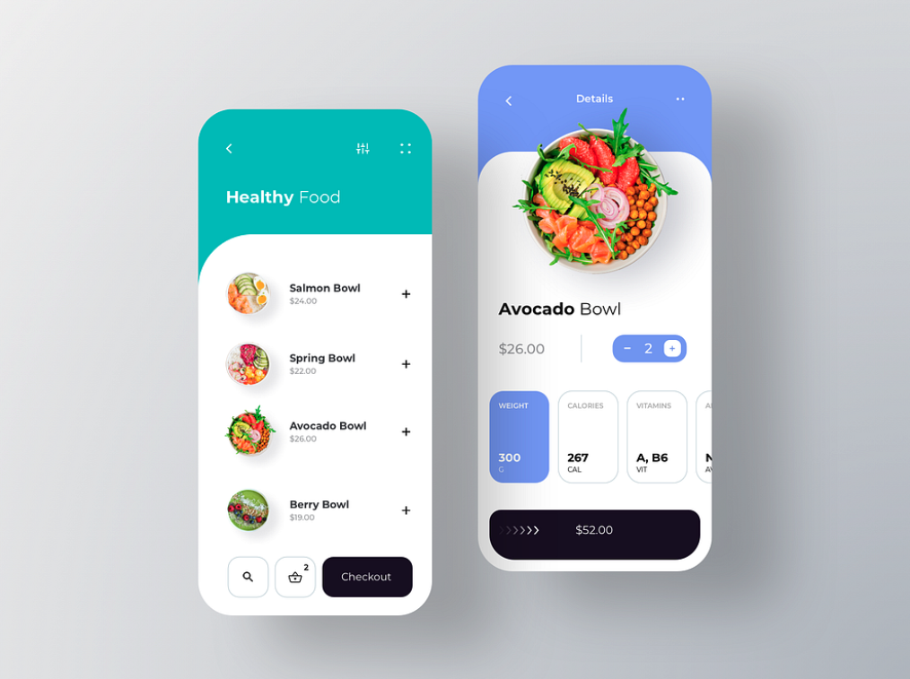

# Flutter UI - FOODY

This Flutter project is a mobile application UI inspired by a design found on Dribbble. The goal of this project is to implement the design with precise detail, creating a smooth and visually appealing user interface.

  
*Design credit: [RonDesignLab](https://dribbble.com/shots/6687016-Foody-Food-by-Subscription)*

## Features

- **Custom Widgets:** The UI is built using custom Flutter widgets to match the design closely.
- **Responsive Design:** The UI is responsive and adapts to different screen sizes.
- **Smooth Animations:** Implemented smooth animations for a better user experience.
- **Scalable Codebase:** Organized and scalable code structure for easy maintenance and updates.

## Getting Started

### Prerequisites

Ensure you have the following installed:

- [Flutter SDK](https://flutter.dev/docs/get-started/install) (vX.X.X or higher)
- [Dart SDK](https://dart.dev/get-dart)
- An IDE like [VSCode](https://code.visualstudio.com/) or [Android Studio](https://developer.android.com/studio)

### Installation

1. **Clone the repository:**
   ```bash
   git clone https://github.com/NabunyaLilian/FoodyUI.git
   ```
2. **Navigate to the project directory:**
   ```bash
   cd foody_ui
   ```
3. **Get the dependencies:**
   ```bash
   flutter pub get
   ```
4. **Run the app:**
   ```bash
   flutter run
   ```

### Folder Structure

```bash
lib/
├── main.dart           # Entry point of the application
├── ui/
│   ├── screens/        # Contains screen widgets
│   ├── widgets/        # Contains reusable widgets
│   ├── themes/         # Theme and style configurations
│   ├── utils/          # Utility classes and functions
└── models/             # Data models for the UI
```

### Customization

You can easily customize the colors, fonts, and other design elements by modifying the files in the `lib/ui/themes` directory.

## Contributing

Contributions are welcome! If you find a bug or have a feature request, please open an issue or submit a pull request.

### Guidelines

- Follow the [Flutter style guide](https://dart.dev/guides/language/effective-dart/style).
- Ensure that the code is well-documented.
- Test your changes thoroughly.

## Acknowledgements

- Original design by [RonDesignLab](https://dribbble.com/RonDesignLab) on Dribbble.
- Thanks to the Flutter community for their support and contributions.

---

Feel free to modify this template to better fit your project specifics.